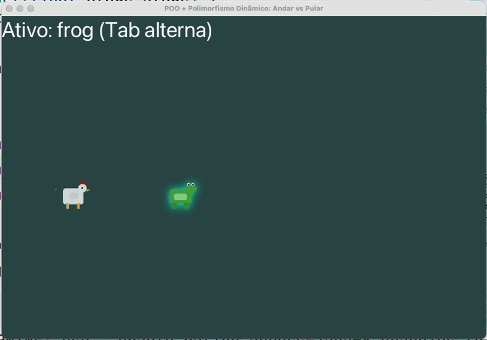
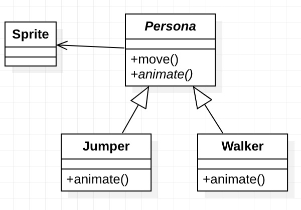

= Exemplo de app JavaFX (OpenFJX) pra mostrar alguns conceitos de POO

Mostra como usar POO para criar classes
e estruturar o código para a construção de
um jogo.

Usa conceitos como classes, herança,
encapsulamento, métodos abstratos,
métodos estáticos, polimorfismo dinâmico (override)
e polimorfismo estático (overload, neste caso de construtores).

A aplicação implementa o diagrama abaixo.
A modelagem usa herança, criando uma super classe Persona (Personagem)
e duas classes filhas que implementam comportamentos específicos:

- Jumper (personagem que pula): onde o método `animate` implementa o comportamento de pular, simulado fazendo-se um "zoom in" e depois "zoom out".
- Walker (personagem que apenas anda): onde o método `animate` implementa uma animação para tornar a transição suave e natural, para dar a impressão de que o personagem está realmente andando.

Essa modelagem, no entanto, tem limitações. Por usar herança, não temos como implementar um personagem que anda ou pula (como um cavalo). E isto foi uma decisão. Não quero ter este tipo de personagem e então não me preocupei em alterar a modelagem para permitir isso.

Existem diferentes maneiras de implementar este comportamento, como usando composição e/ou padrões de projetos (design patterns), mas que não foi abordado aqui porque não era o objetivo.

